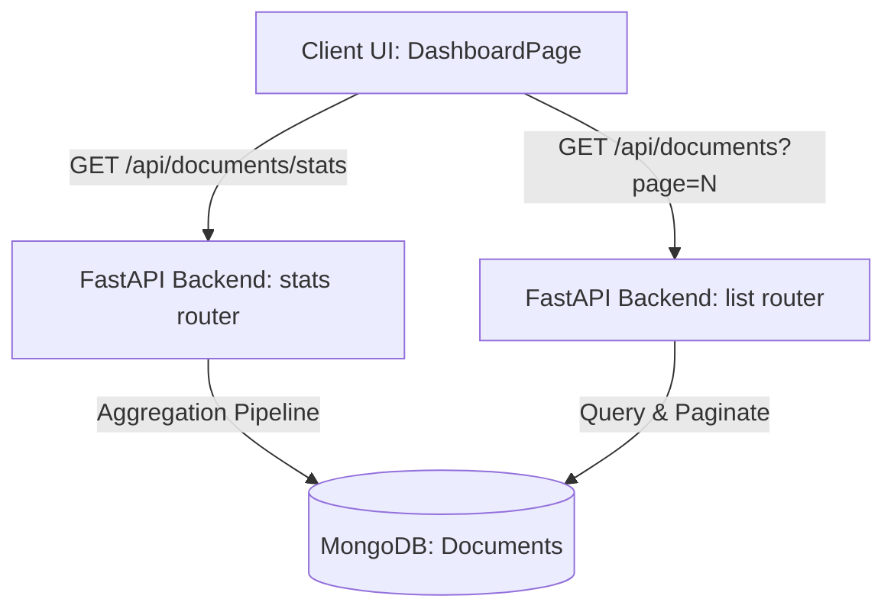

# Developer & Architecture Guide: DocWords Dashboard & System Expansion

Welcome to the **DocWords** (DocuVerse) backend and frontend implementation guide! As your Senior Developer and Architect, I have analyzed your codebase. You are currently around 50% complete with a robust foundation:
*   **Authentication & Tenant Management**: Completed with JWT, Tenant separation, and route protection.
*   **AI Document Processing & Extraction**: Integrated with FastAPI, Tesseract OCR, OpenCV bounding boxes, and OpenAI API with configuration-driven fields.
*   **Ollama Chatbot**: Integrated with local LLM models for chatting with extracted documents.
*   **Bulk Queueing**: Enqueued processing via Redis & ARQ worker background jobs.
*   **Admin Configurations**: Tenant-specific management of document fields and thresholds.

This guide provides a step-by-step roadmap to implement a **Premium Analytics Dashboard** (including charts and document listing in one page) and offers senior-level recommendations to elevate the project to a production-grade enterprise software.

---

## Part 1: Implementing the Unified Analytics Dashboard

We want to design a unified landing experience (`/dashboard`) showing premium analytics charts alongside the document list table in a single responsive viewport.



### Step 1: Create the Backend Stats Endpoint
Create an aggregation endpoint in the backend. Add this code inside `ai_system_tool/backend/routes/documents.py`:

```python
# Place this endpoint inside ai_system_tool/backend/routes/documents.py
# (e.g., right before the @router.get("/documents") endpoint)

@router.get("/documents/stats")
async def get_document_stats(
    user_email: str = Depends(get_current_user),
    tenant_id: str = Depends(get_current_tenant),
):
    """
    Returns aggregated document statistics for the tenant:
    - Total, processing, completed, and failed document counts
    - Document distribution by type
    - Average extraction confidence
    - Upload volume trends over the last 7 days
    """
    db = get_db()
    query = {"user_id": user_email, "tenant_id": tenant_id.lower()}
    
    # 1. Total counts by status
    status_pipeline = [
        {"$match": query},
        {"$group": {"_id": "$status", "count": {"$sum": 1}}}
    ]
    status_cursor = db.documents.aggregate(status_pipeline)
    
    status_counts = {"completed": 0, "processing": 0, "failed": 0, "queued": 0}
    total_docs = 0
    for item in status_cursor:
        status_name = item["_id"] or "processing"
        status_counts[status_name] = item["count"]
        total_docs += item["count"]
        
    # 2. Distribution by document type
    type_pipeline = [
        {"$match": query},
        {"$group": {"_id": "$extracted_data.document_type", "count": {"$sum": 1}}}
    ]
    type_cursor = db.documents.aggregate(type_pipeline)
    
    type_counts = {}
    for item in type_cursor:
        doc_type = item["_id"]
        # Fallback to visual parsing if LLM didn't extract type yet
        if not doc_type:
            doc_type = "Unclassified"
        else:
            doc_type = str(doc_type).title()
        type_counts[doc_type] = type_counts.get(doc_type, 0) + item["count"]

    # 3. Average overall confidence score
    avg_conf_pipeline = [
        {"$match": {**query, "status": "completed", "overall_confidence": {"$gt": 0}}},
        {"$group": {"_id": None, "avg_confidence": {"$avg": "$overall_confidence"}}}
    ]
    avg_conf_cursor = list(db.documents.aggregate(avg_conf_pipeline))
    avg_confidence = round(avg_conf_cursor[0]["avg_confidence"] * 100, 1) if avg_conf_cursor else 0.0

    # 4. Processing volume over the last 7 days
    time_pipeline = [
        {"$match": query},
        {"$group": {
            "_id": {"$dateToString": {"format": "%Y-%m-%d", "date": "$created_at"}},
            "count": {"$sum": 1}
        }},
        {"$sort": {"_id": 1}},
        {"$limit": 7}
    ]
    time_cursor = db.documents.aggregate(time_pipeline)
    volume_over_time = []
    
    # Pre-populate list to avoid missing days
    for item in time_cursor:
        volume_over_time.append({
            "date": item["_id"],
            "uploads": item["count"]
        })
        
    # If empty, insert mock/initial node for smooth chart rendering
    if not volume_over_time:
        volume_over_time.append({"date": "No Data", "uploads": 0})

    return {
        "totalDocs": total_docs,
        "statusCounts": status_counts,
        "typeCounts": type_counts,
        "averageConfidence": avg_confidence,
        "volumeOverTime": volume_over_time
    }
```

> [!NOTE]
> MongoDB's `$dateToString` aggregation operator handles conversion of Python datetime objects natively, keeping queries performant.

---

### Step 2: Register the Frontend API Service
Expose the endpoint to the React frontend. Add this to `ai_system_tool/frontend/src/services/api.js`:

```javascript
// Add inside ai_system_tool/frontend/src/services/api.js

export const getDashboardStats = () => api.get('/documents/stats')
```

---

### Step 3: Implement the Dashboard Component
Create a new file `ai_system_tool/frontend/src/pages/DashboardPage.jsx`. We will use **Recharts** (already installed in package.json) to render high-fidelity charts.

```jsx
import { useState, useEffect } from 'react'
import { useNavigate } from 'react-router-dom'
import {
  FileText, CheckCircle2, AlertTriangle, RefreshCw, BarChart3,
  Search, Eye, Trash2, ChevronLeft, ChevronRight, Clock,
  TrendingUp, Award, Layers, Sparkles
} from 'lucide-react'
import {
  AreaChart, Area, XAxis, YAxis, CartesianGrid, Tooltip, ResponsiveContainer,
  PieChart, Pie, Cell, Legend
} from 'recharts'
import { listDocuments, deleteDocument, getDashboardStats } from '../services/api'

const COLORS = ['#6366f1', '#0ea5e9', '#10b981', '#f59e0b', '#ef4444', '#8b5cf6']
const statusColors = {
  completed: 'bg-[#22c55e]/10 text-[#22c55e] border-[#22c55e]/20',
  processing: 'bg-[#f59e0b]/10 text-[#f59e0b] border-[#f59e0b]/20',
  failed: 'bg-[#ef4444]/10 text-[#ef4444] border-[#ef4444]/20',
}

export default function DashboardPage() {
  const navigate = useNavigate()
  
  // Dashboard Stats States
  const [stats, setStats] = useState(null)
  const [statsLoading, setStatsLoading] = useState(true)
  
  // Documents List States
  const [docs, setDocs] = useState([])
  const [listLoading, setListLoading] = useState(true)
  const [error, setError] = useState('')
  const [search, setSearch] = useState('')
  const [page, setPage] = useState(1)
  const [totalPages, setTotalPages] = useState(1)
  const [deleting, setDeleting] = useState(null)

  // Fetch Dashboard Stats & Documents
  const loadDashboardData = async () => {
    setStatsLoading(true)
    try {
      const statsRes = await getDashboardStats()
      setStats(statsRes.data)
    } catch (err) {
      console.error("Failed to load dashboard metrics", err)
    } finally {
      setStatsLoading(false)
    }
  }

  const fetchDocs = async () => {
    setListLoading(true)
    setError('')
    try {
      const res = await listDocuments(page, 5) // Display 5 documents per page on dashboard
      setDocs(res.data.documents || res.data || [])
      setTotalPages(res.data.totalPages || 1)
    } catch (err) {
      setError(err.message)
    } finally {
      setListLoading(false)
    }
  }

  useEffect(() => {
    loadDashboardData()
  }, [])

  useEffect(() => {
    fetchDocs()
  }, [page])

  const handleDelete = async (id) => {
    if (!window.confirm("Are you sure you want to delete this document?")) return
    setDeleting(id)
    try {
      await deleteDocument(id)
      setDocs((prev) => prev.filter((d) => d._id !== id))
      loadDashboardData() // Refresh metrics
    } catch (err) {
      setError(err.message)
    } finally {
      setDeleting(null)
    }
  }

  const filteredDocs = search
    ? docs.filter((d) =>
        d.original_name?.toLowerCase().includes(search.toLowerCase()) ||
        d.extracted_data?.name?.toLowerCase().includes(search.toLowerCase())
      )
    : docs

  const getDocType = (doc) => {
    return doc.extracted_data?.document_type || 'Unclassified'
  }

  const formatDate = (dateStr) => {
    if (!dateStr) return '—'
    return new Date(dateStr).toLocaleString('en-IN', {
      year: 'numeric', month: 'short', day: 'numeric',
      timeZone: 'Asia/Kolkata',
    })
  }

  // Prep Chart Data
  const pieData = stats?.typeCounts 
    ? Object.keys(stats.typeCounts).map(key => ({ name: key, value: stats.typeCounts[key] }))
    : []

  return (
    <div className="space-y-6">
      {/* Upper Analytics Deck */}
      <div>
        <h2 className="text-2xl font-bold text-[#f1f5f9] flex items-center gap-2">
          <Sparkles className="text-[#6366f1]" size={24} /> Dashboard Overview
        </h2>
        <p className="text-[#64748b] text-sm mt-1">
          Monitor your document extraction queues, success rates, and type distributions.
        </p>
      </div>

      {/* Metric Cards Grid */}
      <div className="grid grid-cols-1 md:grid-cols-4 gap-4">
        {/* Total Card */}
        <div className="bg-[#0f172a] border border-[#1e293b] rounded-xl p-5 hover:border-[#6366f1]/50 transition-all duration-300 relative overflow-hidden group">
          <div className="absolute top-0 right-0 w-24 h-24 bg-gradient-to-br from-[#6366f1]/10 to-transparent rounded-bl-full pointer-events-none" />
          <div className="flex items-center justify-between">
            <span className="text-sm text-[#94a3b8]">Total Processed</span>
            <div className="p-2 bg-[#6366f1]/10 text-[#6366f1] rounded-lg">
              <Layers size={18} />
            </div>
          </div>
          <p className="text-3xl font-extrabold text-[#f1f5f9] mt-4">
            {statsLoading ? '...' : stats?.totalDocs || 0}
          </p>
        </div>

        {/* Completed Card */}
        <div className="bg-[#0f172a] border border-[#1e293b] rounded-xl p-5 hover:border-[#22c55e]/50 transition-all duration-300 relative overflow-hidden">
          <div className="absolute top-0 right-0 w-24 h-24 bg-gradient-to-br from-[#22c55e]/10 to-transparent rounded-bl-full pointer-events-none" />
          <div className="flex items-center justify-between">
            <span className="text-sm text-[#94a3b8]">Completed</span>
            <div className="p-2 bg-[#22c55e]/10 text-[#22c55e] rounded-lg">
              <CheckCircle2 size={18} />
            </div>
          </div>
          <p className="text-3xl font-extrabold text-[#22c55e] mt-4">
            {statsLoading ? '...' : stats?.statusCounts?.completed || 0}
          </p>
        </div>

        {/* Queueing/Processing Card */}
        <div className="bg-[#0f172a] border border-[#1e293b] rounded-xl p-5 hover:border-[#f59e0b]/50 transition-all duration-300 relative overflow-hidden">
          <div className="absolute top-0 right-0 w-24 h-24 bg-gradient-to-br from-[#f59e0b]/10 to-transparent rounded-bl-full pointer-events-none" />
          <div className="flex items-center justify-between">
            <span className="text-sm text-[#94a3b8]">In Progress</span>
            <div className="p-2 bg-[#f59e0b]/10 text-[#f59e0b] rounded-lg">
              <RefreshCw className="animate-spin" size={18} />
            </div>
          </div>
          <p className="text-3xl font-extrabold text-[#f59e0b] mt-4">
            {statsLoading ? '...' : (stats?.statusCounts?.processing || 0) + (stats?.statusCounts?.queued || 0)}
          </p>
        </div>

        {/* Confidence Card */}
        <div className="bg-[#0f172a] border border-[#1e293b] rounded-xl p-5 hover:border-[#0ea5e9]/50 transition-all duration-300 relative overflow-hidden">
          <div className="absolute top-0 right-0 w-24 h-24 bg-gradient-to-br from-[#0ea5e9]/10 to-transparent rounded-bl-full pointer-events-none" />
          <div className="flex items-center justify-between">
            <span className="text-sm text-[#94a3b8]">Avg. Confidence</span>
            <div className="p-2 bg-[#0ea5e9]/10 text-[#0ea5e9] rounded-lg">
              <Award size={18} />
            </div>
          </div>
          <p className="text-3xl font-extrabold text-[#0ea5e9] mt-4">
            {statsLoading ? '...' : `${stats?.averageConfidence || 0}%`}
          </p>
        </div>
      </div>

      {/* Visual Chart Hub */}
      <div className="grid grid-cols-1 lg:grid-cols-3 gap-6">
        {/* volume trend area chart */}
        <div className="bg-[#0f172a] border border-[#1e293b] rounded-xl p-5 lg:col-span-2">
          <div className="flex items-center justify-between mb-4">
            <h3 className="text-sm font-semibold text-[#f1f5f9] flex items-center gap-2">
              <TrendingUp size={16} className="text-[#6366f1]" /> Processing Volume (Last 7 Days)
            </h3>
          </div>
          <div className="h-64">
            {statsLoading ? (
              <div className="h-full flex items-center justify-center text-[#64748b]">Loading trends...</div>
            ) : (
              <ResponsiveContainer width="100%" height="100%">
                <AreaChart data={stats?.volumeOverTime || []}>
                  <defs>
                    <linearGradient id="colorUploads" x1="0" y1="0" x2="0" y2="1">
                      <stop offset="5%" stopColor="#6366f1" stopOpacity={0.3}/>
                      <stop offset="95%" stopColor="#6366f1" stopOpacity={0}/>
                    </linearGradient>
                  </defs>
                  <CartesianGrid strokeDasharray="3 3" stroke="#1e293b" />
                  <XAxis dataKey="date" stroke="#64748b" tick={{ fill: '#64748b', fontSize: 11 }} />
                  <YAxis stroke="#64748b" tick={{ fill: '#64748b', fontSize: 11 }} allowDecimals={false} />
                  <Tooltip 
                    contentStyle={{ backgroundColor: '#0f172a', borderColor: '#1e293b', borderRadius: '8px' }} 
                    labelStyle={{ color: '#94a3b8' }}
                  />
                  <Area type="monotone" dataKey="uploads" stroke="#6366f1" strokeWidth={2} fillOpacity={1} fill="url(#colorUploads)" />
                </AreaChart>
              </ResponsiveContainer>
            )}
          </div>
        </div>

        {/* type breakdown pie chart */}
        <div className="bg-[#0f172a] border border-[#1e293b] rounded-xl p-5">
          <h3 className="text-sm font-semibold text-[#f1f5f9] flex items-center gap-2 mb-4">
            <BarChart3 size={16} className="text-[#0ea5e9]" /> Document Types
          </h3>
          <div className="h-64 flex flex-col justify-center">
            {statsLoading ? (
              <div className="text-center text-[#64748b]">Loading distribution...</div>
            ) : pieData.length === 0 ? (
              <div className="text-center text-[#64748b] text-xs">No classification data recorded</div>
            ) : (
              <div className="relative h-full w-full">
                <ResponsiveContainer width="100%" height="90%">
                  <PieChart>
                    <Pie
                      data={pieData}
                      cx="50%"
                      cy="50%"
                      innerRadius={60}
                      outerRadius={80}
                      paddingAngle={4}
                      dataKey="value"
                    >
                      {pieData.map((entry, index) => (
                        <Cell key={`cell-${index}`} fill={COLORS[index % COLORS.length]} />
                      ))}
                    </Pie>
                    <Tooltip 
                      contentStyle={{ backgroundColor: '#0f172a', borderColor: '#1e293b', borderRadius: '8px' }}
                    />
                  </PieChart>
                </ResponsiveContainer>
                {/* Custom Compact Legends */}
                <div className="flex flex-wrap justify-center gap-x-3 gap-y-1 text-[11px] text-[#cbd5e1]">
                  {pieData.map((item, index) => (
                    <span key={item.name} className="flex items-center gap-1">
                      <span className="w-2.5 h-2.5 rounded-full" style={{ backgroundColor: COLORS[index % COLORS.length] }} />
                      {item.name} ({item.value})
                    </span>
                  ))}
                </div>
              </div>
            )}
          </div>
        </div>
      </div>

      {/* Embedded Document Listing (FIFO Queue-friendly View) */}
      <div className="bg-[#0f172a] border border-[#1e293b] rounded-xl p-5 space-y-4">
        <div className="flex flex-col md:flex-row md:items-center justify-between gap-4">
          <div>
            <h3 className="text-base font-semibold text-[#f1f5f9]">Recent Extractions</h3>
            <p className="text-xs text-[#64748b]">Monitor queue states, verify details, or navigate to full previews</p>
          </div>
          <div className="relative w-full md:w-64">
            <Search size={16} className="absolute left-3 top-1/2 -translate-y-1/2 text-[#64748b]" />
            <input
              type="text"
              placeholder="Filter by name..."
              value={search}
              onChange={(e) => setSearch(e.target.value)}
              className="w-full pl-9 pr-4 py-1.5 bg-[#0b0f19] border border-[#1e293b] rounded-lg text-[#f1f5f9] text-xs placeholder-[#64748b] focus:outline-none focus:border-[#6366f1]"
            />
          </div>
        </div>

        {error && (
          <div className="p-3 bg-[#ef4444]/10 border border-[#ef4444]/20 rounded-lg text-[#ef4444] text-xs">
            {error}
          </div>
        )}

        <div className="overflow-x-auto">
          <table className="w-full text-left">
            <thead>
              <tr className="border-b border-[#1e293b] text-xs text-[#64748b]">
                <th className="pb-3 font-medium">Document Name</th>
                <th className="pb-3 font-medium">Doc Type</th>
                <th className="pb-3 font-medium">Status</th>
                <th className="pb-3 font-medium">Extracted Name</th>
                <th className="pb-3 font-medium">Timestamp</th>
                <th className="pb-3 font-medium text-right">Actions</th>
              </tr>
            </thead>
            <tbody>
              {listLoading ? (
                <tr>
                  <td colSpan={6} className="text-center py-8">
                    <RefreshCw className="animate-spin text-[#6366f1] mx-auto" size={20} />
                  </td>
                </tr>
              ) : filteredDocs.length === 0 ? (
                <tr>
                  <td colSpan={6} className="text-center py-8 text-xs text-[#64748b]">
                    No recent files registered in database.
                  </td>
                </tr>
              ) : (
                filteredDocs.map((doc) => (
                  <tr key={doc._id} className="border-b border-[#1e293b] text-xs hover:bg-[#1e293b]/20 transition-colors">
                    <td className="py-3 font-medium text-[#f1f5f9] max-w-[150px] truncate">
                      {doc.original_name}
                    </td>
                    <td className="py-3 text-[#cbd5e1]">{getDocType(doc)}</td>
                    <td className="py-3">
                      <span className={`inline-flex items-center gap-1 px-2 py-0.5 rounded-full text-[10px] font-semibold border ${statusColors[doc.status] || statusColors.processing}`}>
                        <span className={`w-1 h-1 rounded-full ${doc.status === 'processing' ? 'animate-pulse bg-[#f59e0b]' : doc.status === 'completed' ? 'bg-[#22c55e]' : 'bg-[#ef4444]'}`} />
                        {doc.status}
                      </span>
                    </td>
                    <td className="py-3 text-[#cbd5e1]">{doc.extracted_data?.name || '—'}</td>
                    <td className="py-3 text-[#64748b]">{formatDate(doc.created_at)}</td>
                    <td className="py-3 text-right">
                      <div className="flex items-center justify-end gap-1">
                        <button
                          onClick={() => navigate(`/extraction/${doc._id}`)}
                          className="p-1.5 hover:bg-[#1e293b] rounded-md text-[#64748b] hover:text-[#6366f1]"
                          title="View Extraction"
                        >
                          <Eye size={14} />
                        </button>
                        <button
                          onClick={() => handleDelete(doc._id)}
                          disabled={deleting === doc._id}
                          className="p-1.5 hover:bg-[#1e293b] rounded-md text-[#64748b] hover:text-[#ef4444]"
                        >
                          <Trash2 size={14} />
                        </button>
                      </div>
                    </td>
                  </tr>
                ))
              )}
            </tbody>
          </table>
        </div>

        {/* Mini Pagination Footer */}
        {totalPages > 1 && (
          <div className="flex items-center justify-between pt-2">
            <span className="text-[10px] text-[#64748b]">Page {page} of {totalPages}</span>
            <div className="flex items-center gap-1">
              <button
                onClick={() => setPage(p => Math.max(1, p - 1))}
                disabled={page <= 1}
                className="p-1 border border-[#1e293b] rounded-md text-[#64748b] disabled:opacity-50 hover:bg-[#1e293b]"
              >
                <ChevronLeft size={12} />
              </button>
              <button
                onClick={() => setPage(p => Math.min(totalPages, p + 1))}
                disabled={page >= totalPages}
                className="p-1 border border-[#1e293b] rounded-md text-[#64748b] disabled:opacity-50 hover:bg-[#1e293b]"
              >
                <ChevronRight size={12} />
              </button>
            </div>
          </div>
        )}
      </div>
    </div>
  )
}
```

---

### Step 4: Register Routing and Sidebar Navigation

#### A. Mount Dashboard Route in `ai_system_tool/frontend/src/App.jsx`
Import and register the new dashboard page. Update your router definitions:

```jsx
// 1. Add import:
import DashboardPage from './pages/DashboardPage'

// 2. Modify routes:
function App() {
  return (
    <Routes>
      <Route path="/login" element={<PublicRoute><LoginPage /></PublicRoute>} />
      <Route path="/signup" element={<PublicRoute><SignupPage /></PublicRoute>} />
      <Route path="/forgot-password" element={<PublicRoute><ForgotPasswordPage /></PublicRoute>} />
      <Route path="/reset-password" element={<ResetPasswordPage />} />
      
      {/* Update index page to land on the dashboard */}
      <Route path="/" element={<ProtectedRoute><Navigate to="/dashboard" replace /></ProtectedRoute>} />
      
      {/* New dashboard route */}
      <Route path="/dashboard" element={<ProtectedRoute><DashboardPage /></ProtectedRoute>} />
      
      <Route path="/upload" element={<ProtectedRoute><UploadPage /></ProtectedRoute>} />
      <Route path="/extraction/:id" element={<ProtectedRoute><ExtractionPage /></ProtectedRoute>} />
      <Route path="/documents" element={<ProtectedRoute><DocumentListPage /></ProtectedRoute>} />
      <Route path="/chat" element={<ProtectedRoute><ChatPage /></ProtectedRoute>} />
      <Route path="/admin" element={<ProtectedRoute><AdminConfigsPage /></ProtectedRoute>} />
      <Route path="/bulk" element={<ProtectedRoute><BulkUploadPage /></ProtectedRoute>} />
    </Routes>
  )
}
```

#### B. Place Dashboard in Sidebar Navigation (`ai_system_tool/frontend/src/layouts/Layout.jsx`)
Import `LayoutGrid` or keep `Layers`/`BarChart3` icon to show the dashboard. Change navigation items array inside `Layout.jsx`:

```javascript
// Add LayoutGrid to icons import at top:
import {
  Upload, FileText, Database, Menu, X, Sparkles, ChevronLeft, LogOut, User, MessageSquare, Settings, Layers, LayoutGrid
} from 'lucide-react'

// Modify the navigation list array:
const allNavItems = [
  { path: '/dashboard', label: 'Dashboard', icon: LayoutGrid, adminOnly: false },
  { path: '/upload', label: 'Upload', icon: Upload, adminOnly: false },
  { path: '/bulk', label: 'Bulk Upload', icon: Layers, adminOnly: false },
  { path: '/documents', label: 'Documents', icon: FileText, adminOnly: false },
  { path: '/chat', label: 'Chat', icon: MessageSquare, adminOnly: false },
  { path: '/admin', label: 'Configs', icon: Settings, adminOnly: true },
]
```

---

## Part 2: Senior Developer Recommendations (Next 50% Milestone)

To transform **DocWords** into an enterprise-grade document intelligence platform, we recommend implementing the following premium features:

### 1. Pre-Extraction Auto-Classification Engine
*   **Current Limit**: The system applies templates (like Aadhaar card / PAN card) based on manual selections or keyword matching against original filenames.
*   **Recommendation**: Implement a multi-modal classification step. When a file completes OCR, send the first 1,000 characters of raw OCR text to a fast classifier (like GPT-4o-mini or a localized Ollama Llama-3 model). Instruct the LLM to choose the document type from your configurations.
*   **Benefits**: Zero manual setup for users. They upload 100 documents in bulk, and the system automatically matches the configurations for Aadhar, PAN, or Passport behind the scenes.

```
Upload -> OCR Text -> LLM Classifier -> Match Config Schema -> Target Extraction
```

---

### 2. Interactive Bounding-Box Highlight in Document Preview
*   **Current Limit**: The document preview (PDF/Image) is on the left, and the text values are in input boxes on the right, but they aren't linked.
*   **Recommendation**: The backend is already extracting OCR word coordinates (`ocr_words` array with bounding boxes). Map these boxes onto a canvas layered over your document viewer. When the user clicks an extracted field (e.g., "Aadhaar Card Number"), draw a glowing neon highlight box on the document preview pointing exactly where that text was found!
*   **Implementation Tip**: 
    1. Translate the relative coordinates from `ocr_words` to CSS viewport coordinates.
    2. Add `onFocus` listeners to form inputs that toggle coordinate overlays.

---

### 3. Human-in-the-Loop (HITL) Verification Dashboard
*   **Current Limit**: Documents are either "completed" or "failed".
*   **Recommendation**: Introduce a third status: `needs_verification`. If a document's `overall_confidence` score drops below the confidence threshold defined in **Admin Configs** (e.g. `0.78` for Aadhaar), route it to a verification queue.
*   **UI Design**: The user opens the document, and fields with low confidence are highlighted in yellow/red. Once the user clicks "Approve Extractions", update status to `completed`.

---

### 4. Advanced Bounding Box Croppers (Face & Signature Crop)
*   **Recommendation**: For identity documents, add automatic image crops. Write a backend OpenCV service that uses coordinates of the detected `name` or `signature` field to crop the cardholder's face photo and signature block, saving them as secondary static file entities.
*   **Use Cases**: Crucial for automated KYC verification where developers need to run facial match checks between the card portrait and a live selfie.

---

### 5. Webhook Notifications & Export Hub
*   **Recommendation**: 
    *   **Webhooks**: Let admins configure a Webhook URL (e.g. `https://my-erp.com/api/receive-kyc`). When extraction succeeds, send a POST request payload containing the clean JSON extracted data.
    *   **Bulk Export**: Enable users to select multiple documents on the Dashboard and click **"Export as ZIP"** (containing raw PDFs + JSON metadata) or **"Export as Consolidated CSV"** (mapping fields dynamically as column headers).

---

## Part 3: Testing & Verification Plan

### 1. Verification of Aggregations
To ensure the backend dashboard calculations run without failing MongoDB queries, run the aggregation queries manually inside your Mongo database console (or MongoDB Compass) to verify indexes:
```js
// Ensure indexes exist for rapid dashboards:
db.documents.createIndex({ user_id: 1, tenant_id: 1, created_at: -1 })
db.documents.createIndex({ user_id: 1, tenant_id: 1, status: 1 })
```

### 2. Frontend Layout & Recharts Bounds
Ensure the parent div of `<ResponsiveContainer>` has a fixed pixel height (e.g., `className="h-64"`). Recharts containers will collapse to `0px` if placed directly inside responsive grid layers without wrapper definitions.
